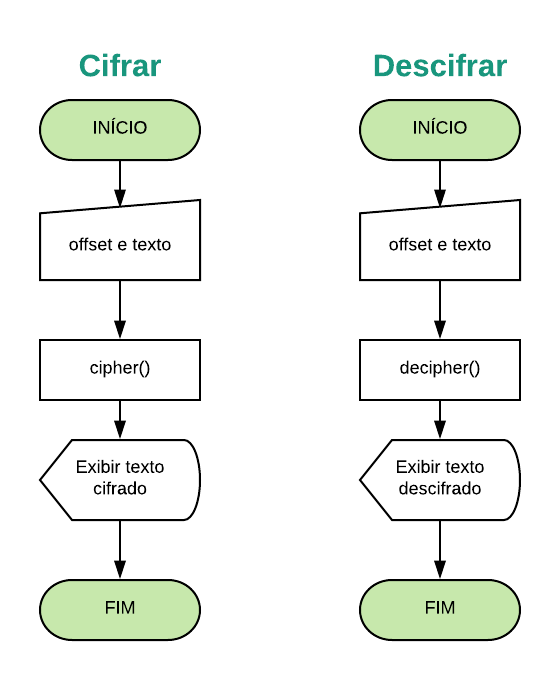

# Cifra de César

## Prefácio
:balloon::balloon::balloon:
O aniversário da sua mãe está se aproximando e você está organizando uma festa
surpresa. Para manter a festa em segredo foi criado um grupo de Whatsapp com
amigxs e familiares. O problema é que as vezes sua mãe utiliza o seu celular
e pode ser que ela veja as suas mensagens. Como a festa é surpresa, você
decide criar uma aplicação que permita enviar mensagens criptografadas e depois
descriptografar. Então agora é a hora de aplicar os seus super poderes 😎

## Desenvolvimento da aplicação
1. **UX**: definição do usuário, planejamento da interface e funcionalidades.
2. **Sequência Lógica**: planejamento da sequência lógica necessária para desenvolvimento do código para esta aplicação.
3. **Diagrama de blocos**: desevolvimento do fluxograma.
4. **HTML**: desenvolvimento do HTML base para a aplicação.
5. **Javascript**: desenvolvimento do código Javascript e primeiros testes de funcionamento.
6. **CSS**: desenvolvimento do CSS.
7. **Revisão**: revisão do código, implementações necessárias HTML, CSS, JavaScript.
8. **Testes**: desenvolvimento de testes para validar o funcionamento esperado da aplicação.

### Diagrama de blocos

## Definição dos usuários
Através do prefácio adotado, consideram-se os usuários como familiares e amigos (pessoas próximas), entre adolescentes e adultos, de todos os sexos, que estarão engajados na organização da festa surpresa.

Dessa forma, o desenvolvimento da interface foi realizado,procurando proporcionar uma usabilidade intuitiva e simples, para que o usuário possa fazer uso da aplicação com facilidade e rapidez.

A escolha de ícones e fontes foi realizada pensando em proporcionar a sensação de mistério e segredo ao usuário no contexto da festa surpresa, mantendo a legibilidade e auxiliando visualmente o entendimento do uso intuitivo da aplicação.

### Pesquisa e formulário
Foi realizada uma pesquisa através de formulário para verificar a usabilidade da aplicação e validar a experiência de usuário planejada.

* [Formulário](https://goo.gl/forms/ExNJc5uvLzWo8y3E2)

* [Dados Obtidos]()

## Checklist

### Parte Obrigatória

* [ ] `README.md` com explicações e desenho do projeto
* [ ] Usar VanillaJS.
* [ ] Permitir escrever um texto, com letras maiúsculas e minúsculas, para ser
  cifrado.
* [ ] Mostrar o resultado da cifra corretamente.
* [ ] Permitir escrever um texto, com letras maiúsculas e minúsculas, para ser
  descifrado.
* [ ] Mostrar o resultado descifrado corretamente.
* [ ] Permitir escolher o `offset` (_deslocamento_) a ser usado na
  cifragem/descifragem.
* [ ] Implementa `cipher.encode`.
* [ ] Implementa `cipher.decode`.
* [ ] Criar testes unitários.

### Parte Opcional: "Hacker edition"

* [ ] Permite usar um `offset` (_deslocamento_) negativo
* [ ] Cifra/descifra _outros_ caracteres (espaços, pontuação, `ã`, `á`, ...)
