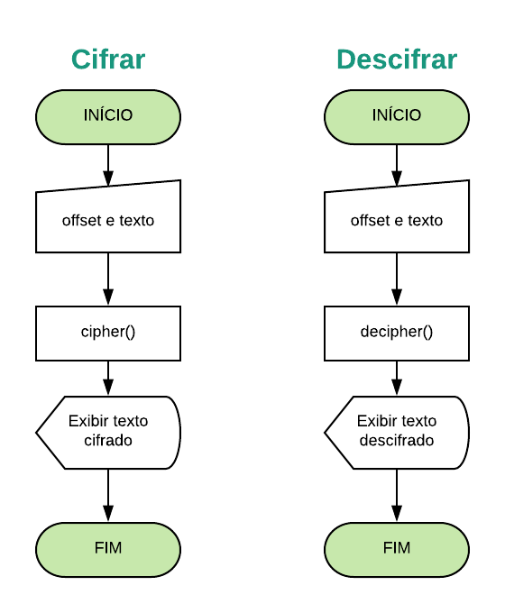
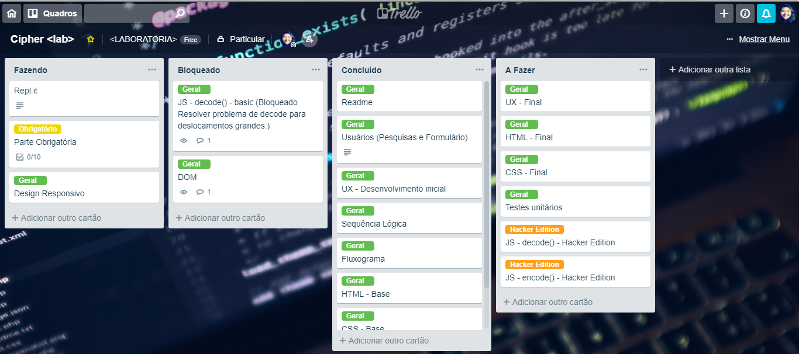
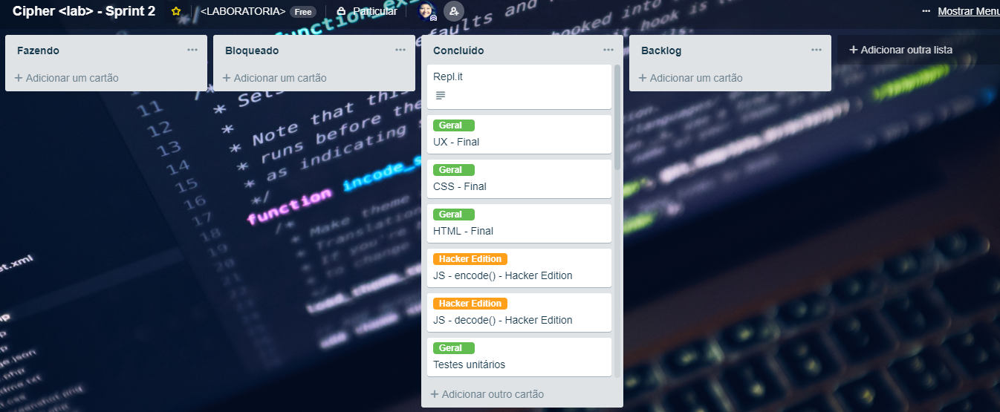
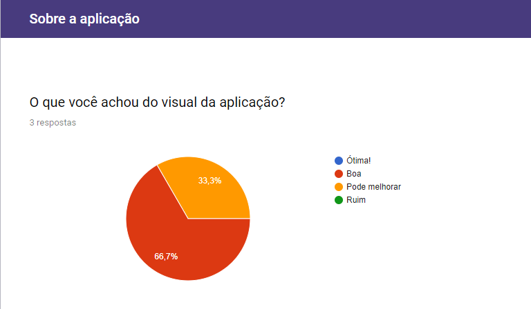
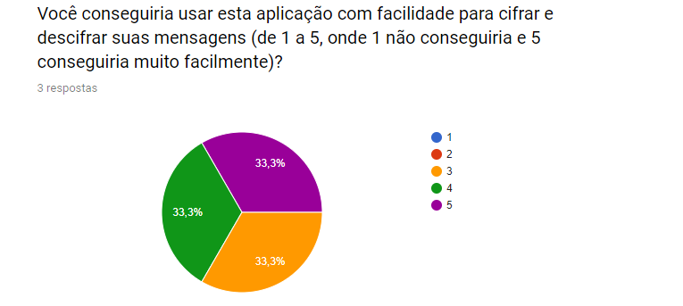
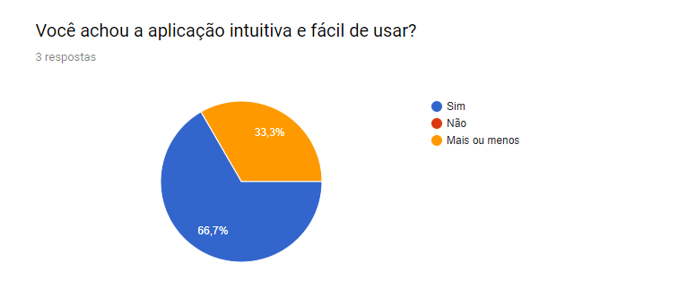
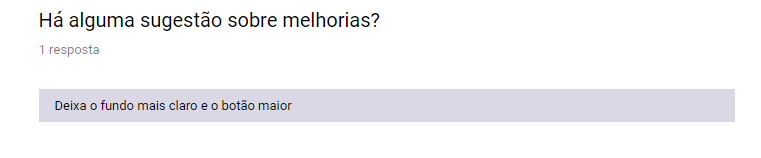

# Cifra de César

[Acesse a aplicação: **Cipher Laboratoria**](https://hlays.github.io/caesar-cipher/src/index.html)

## Prefácio
:balloon::balloon::balloon:

O aniversário da sua mãe está se aproximando e você está organizando uma festa
surpresa. Para manter a festa em segredo foi criado um grupo de Whatsapp com
amigxs e familiares. O problema é que as vezes sua mãe utiliza o seu celular
e pode ser que ela veja as suas mensagens. Como a festa é surpresa, você
decide criar uma aplicação que permita enviar mensagens criptografadas e depois
descriptografar. Então agora é a hora de aplicar os seus super poderes 😎

---

## Funcionamento da aplicação

A aplicação cipher, em sua primeira *screen* exibe ao usuário a decisão de **cifrar** ou **decifrar** uma mensagem, ao clicar no botão correspondente, o usuário será direcionado para outra *screen*, onde deverá informar o deslocamento/chave (um número inteiro, positivo ou negativo) correspondente à cifragem em questão. 

Ao digitar a mensagem, automaticamente o resultado da cifragem/descifragem será exibido no campo *Resultado* logo abaixo do campo de texto.

A aplicação utiliza a chave numérica para deslocar a letra informada até a letra correspondente do alfabeto realizando o processo de cifrar e descifrar através das funções encode e decode respectivamente.

---

## Desenvolvimento
1. **UX**: definição do usuário, planejamento da interface e funcionalidades.
2. **Sequência Lógica**: planejamento da sequência lógica necessária para desenvolvimento do código para esta aplicação.
3. **Diagrama de blocos**: desevolvimento do fluxograma.
4. **HTML**: desenvolvimento do HTML base para a aplicação.
5. **Javascript**: desenvolvimento do código Javascript e primeiros testes de funcionamento.
6. **CSS**: desenvolvimento do CSS.
7. **Revisão**: revisão do código, implementações necessárias HTML, CSS, JavaScript.
8. **Testes**: desenvolvimento de testes para validar o funcionamento esperado da aplicação.

### Diagrama de blocos

## Backlog Desenvolvimento

Sprint 1

Sprint 2

## Definição dos usuários
Através do prefácio adotado, consideram-se os usuários como familiares e amigos (pessoas próximas), entre adolescentes e adultos, de todos os sexos, que estarão engajados na organização da festa surpresa.

Dessa forma, o desenvolvimento da interface foi realizado,procurando proporcionar uma usabilidade intuitiva e simples, para que o usuário possa fazer uso da aplicação com facilidade e rapidez.

A escolha de ícones e fontes foi realizada pensando em proporcionar a sensação de mistério e segredo ao usuário no contexto da festa surpresa, mantendo a legibilidade e auxiliando visualmente o entendimento do uso intuitivo da aplicação.

## Pesquisa e formulário
Foi realizada uma pesquisa através de formulário para verificar a usabilidade da aplicação e validar a experiência de usuário planejada.

*Foram coletadas repostas de 3 usuários.*

* [Formulário](https://goo.gl/forms/ExNJc5uvLzWo8y3E2)

* [Dados Obtidos](https://docs.google.com/spreadsheets/d/13LXJI_NV1p7XbUNtWGDBg_HUw3B8PYSlZwnZsiOUXfA/edit?usp=sharing)

### Resumo das respostas obtidas
1. Visual da aplicação

2. Facilidade de uso / Interface

3. Design intuitivo

4. Sugestão

### Análise das informações coletadas
Com base nas informações coletadas até o momento, verifica-se a necessidade de melhorar o design responsivo da aplicação, e a relação entre a imagem background e a cor das fontes utilizadas.

---

## Aprendizado 
Novos itens aprendidos ou aperfeiçoados durante a realização deste projeto:

- HTML:
  - Viewport: `<meta name="viewport" content="width=device-width, user-scalable=yes">` para controlar o tamanho e a escala da viewport, neste caso, impedindo o navegador de renderizar a página, controlando o tamanho da viewport correspondendo à própria largura onde o conteúdo está sendo exibido (`device-width`).
- CSS:
  - Dimensões: `em` (relacionado ao elemento pai), `vh` (altura da viewport), `vw` (largura da viewport),
  - `background-attachment: fixed` para manter o background fixo durante a rolagem da página,
  - flexbox.
- Javascipt:
  - 'Chamar' função através de `addEventListener` (input),
  - Utilizar método `charCodeAt()` para retornar o valor Unicode a partir de uma string,
  - Utilizar método `String.fromCharCode()` para retornar uma string através de valores Unicode,
  - Criar e executar Testes.

---

## Checklist

### Parte Obrigatória

* [x] `README.md` com explicações e desenho do projeto
* [x] Usar VanillaJS.
* [x] Permitir escrever um texto, com letras maiúsculas e minúsculas, para ser cifrado.
* [x] Mostrar o resultado da cifra corretamente.
* [x] Permitir escrever um texto, com letras maiúsculas e minúsculas, para ser descifrado.
* [x] Mostrar o resultado descifrado corretamente.
* [x] Permitir escolher o `offset` (_deslocamento_) a ser usado na cifragem/descifragem.
* [x] Implementa `cipher.encode`.
* [x] Implementa `cipher.decode`.
* [x] Criar testes unitários.

### Parte Opcional: "Hacker edition"

* [x] Permite usar um `offset` (_deslocamento_) negativo
* [x] Cifra/descifra _outros_ caracteres (espaços, pontuação, `ã`, `á`, ...)

---
**Para mais informações sobre a Cifra de César**

* *[Projeto Cifra de Cesar Laboratoria](https://github.com/rafaelbcerri/caesar-cipher)*
* *[Wikipedia](https://pt.wikipedia.org/wiki/Cifra_de_C%C3%A9sar)*
